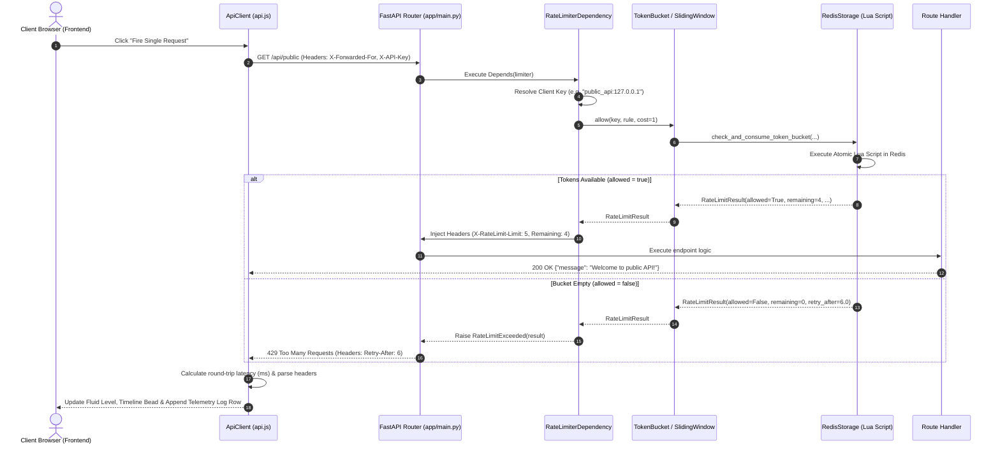

# RateShield: Production-Grade Distributed Rate Limiting System
## Complete System Architecture, Algorithmic Formulation & Implementation Guide

---

## Table of Contents
1. [Executive Summary & High-Level Introduction](#1-executive-summary--high-level-introduction)
2. [Core Fundamentals: Rate Limiting Explained from Scratch](#2-core-fundamentals-rate-limiting-explained-from-scratch)
3. [The Two Rate Limiting Algorithms in Depth](#3-the-two-rate-limiting-algorithms-in-depth)
   - [Algorithm A: Token Bucket](#algorithm-a-token-bucket)
   - [Algorithm B: Sliding Window Counter (Log / Sorted Set)](#algorithm-b-sliding-window-counter-log--sorted-set)
   - [Comparison Matrix: Token Bucket vs. Sliding Window](#comparison-matrix-token-bucket-vs-sliding-window)
4. [The Race Condition Problem & Atomic Redis Lua Scripts](#4-the-race-condition-problem--atomic-redis-lua-scripts)
5. [Complete Codebase Architecture & File Breakdown](#5-complete-codebase-architecture--file-breakdown)
   - [Backend Architecture (`backend/`)](#backend-architecture-backend)
   - [Frontend Architecture (`frontend/`)](#frontend-architecture-frontend)
6. [End-to-End Request Lifecycle & Working Flow](#6-end-to-end-request-lifecycle--working-flow)
7. [Protected Endpoints & Demonstration Scenarios](#7-protected-endpoints--demonstration-scenarios)
8. [Benchmarks, Concurrency Testing & Performance](#8-benchmarks-concurrency-testing--performance)
9. [How to Run and Verify the System Locally](#9-how-to-run-and-verify-the-system-locally)
10. [Technical Interview Defense Guide & Engineering Trade-Offs](#10-technical-interview-defense-guide--engineering-trade-offs)

---

## 1. Executive Summary & High-Level Introduction

### What is RateShield?
**RateShield** is a production-grade, distributed rate-limiting infrastructure built with **Python 3, FastAPI, and Redis**, paired with a **zero-dependency interactive real-time telemetry frontend** (HTML5, Vanilla CSS3, ES6 JavaScript).

### What Problem Does it Solve?
In any modern web service, APIs are exposed to the public internet. Without rate limiting, applications are vulnerable to:
1. **Denial of Service (DoS/DDoS) & Traffic Spikes**: A single client or coordinated botnet can flood the server with millions of requests per second, exhausting CPU, memory, and database connection pools.
2. **Brute-Force & Credential Stuffing**: Attackers repeatedly attempt logins with thousands of username/password combinations.
3. **Noisy Neighbor Problem**: In multi-tenant SaaS environments, one hyperactive client can hog resources, degrading performance for paying customers.
4. **Third-Party & LLM Cost Exhaustion**: Endpoints that query costly external APIs (e.g., OpenAI, Stripe, SMS gateways) can rack up massive bills if unmetered.
5. **Cascading Failures**: When downstream databases or services slow down, unthrottled incoming traffic creates queuing bottlenecks that crash the entire backend cluster.

### The Real-World Analogy
Think of a rate limiter like a **bouncer at the entrance of an exclusive nightclub**:
- **Club Capacity (Rule Capacity)**: The club allows at most 50 guests inside at any time.
- **Entry Rate (Refill Rate)**: As guests leave (or as time ticks forward), the bouncer permits new guests to enter.
- **VIP Guest vs Regular Guest (Tiering)**: VIP cardholders (Pro/Enterprise API keys) get immediate priority and a much higher entry allowance than unverified guests (Anonymous IP).
- **Turnstile Mechanism (Atomic Redis Lua)**: Only one person can pass through the turnstile gate at a fraction of a second, preventing two people from squeezing through simultaneously (Zero Race Conditions).
- ** Polite Backoff Advice (RFC 6585 Headers)**: When the venue is full, the bouncer hands you a ticket: *"We are at full capacity. Check back in 12 seconds"* (`HTTP 429 Too Many Requests`, `Retry-After: 12`).

---

## 2. Core Fundamentals: Rate Limiting Explained from Scratch

### 2.1 The HTTP 429 "Too Many Requests" Status Code
Defined in **RFC 6585 (Section 4)**, HTTP status code **429** indicates that the user has sent too many requests in a given amount of time. Unlike 400 (Bad Request) or 500 (Internal Server Error), a 429 indicates that the request itself is valid, but the caller has temporarily exceeded their allowed quota.

### 2.2 Standard Telemetry Headers
Every response emitted by RateShield—whether accepted (200 OK) or throttled (429)—includes four industry-standard response headers:

| Header Name | Type | Example | Purpose |
|:---|:---:|:---:|:---|
| `X-RateLimit-Limit` | Integer | `30` | The maximum request quota permitted within the active evaluation window. |
| `X-RateLimit-Remaining` | Integer | `14` | How many requests the client can still make before being blocked. |
| `X-RateLimit-Reset` | Unix Epoch | `1790539200` | The exact Unix timestamp (in seconds) when the current window expires or quota resets. |
| `Retry-After` | Integer | `7` | Included **only on 429 responses**: tells the client exactly how many seconds to pause before retrying. |

```http
HTTP/1.1 429 Too Many Requests
Content-Type: application/json
X-RateLimit-Limit: 5
X-RateLimit-Remaining: 0
X-RateLimit-Reset: 1790539215
Retry-After: 6

{
  "detail": {
    "error": "Too Many Requests",
    "retry_after_seconds": 6,
    "reset_epoch": 1790539215,
    "limit": 5
  }
}
```

### 2.3 Fail-Open vs. Fail-Closed
What happens when the caching layer (Redis) crashes, network cables disconnect, or Redis times out?
- **Fail-Closed**: If Redis fails, reject every incoming request. *Result*: A cache failure knocks your entire API offline.
- **Fail-Open (Implemented in RateShield)**: If Redis fails, log a critical warning and **allow the request through**. Rate limiting is an operational protection layer; it should never become a single point of failure that disables legitimate business traffic.

---

## 3. The Two Rate Limiting Algorithms in Depth

RateShield implements two complementary, industry-standard algorithms:

```
                      RATE LIMITING ALGORITHMS
                                 │
         ┌───────────────────────┴───────────────────────┐
         ▼                                               ▼
   TOKEN BUCKET                                   SLIDING WINDOW
   • Capacity + Refill Rate                       • Rolling Time Log
   • Allows Controlled Bursts                     • 100% Boundary-Accurate
   • Ideal for General APIs                       • Ideal for Auth & Billing
```

---

### Algorithm A: Token Bucket

#### Conceptual Model
Imagine a bucket with a fixed capacity $C$ (e.g., 5 tokens).
1. Tokens are dropped into the bucket at a constant rate $r$ tokens per second ($r = C / W$, where $W$ is the window in seconds).
2. The bucket cannot overflow; excess tokens beyond capacity $C$ spill out and are discarded.
3. When a request arrives with cost $k$ (default $k=1$):
   - If at least $k$ tokens are in the bucket: consume $k$ tokens and allow the request.
   - If fewer than $k$ tokens are available: reject the request with HTTP 429.

#### Continuous Lazy Refill Formula
Instead of running an expensive background timer to add tokens every second, RateShield uses **lazy evaluation**. When a request arrives at timestamp $t_{\text{now}}$:

$$\Delta t = \max(0, t_{\text{now}} - t_{\text{last\_updated}})$$

$$\text{tokens}_{\text{current}} = \min(C, \text{tokens}_{\text{previous}} + (\Delta t \times r))$$

If $\text{tokens}_{\text{current}} \ge \text{cost}$:
$$\text{tokens}_{\text{new}} = \text{tokens}_{\text{current}} - \text{cost} \quad \implies \quad \text{ALLOW}$$
Else:
$$\text{deficit} = \text{cost} - \text{tokens}_{\text{current}}$$
$$\text{retry\_after} = \frac{\text{deficit}}{r} \quad \implies \quad \text{REJECT (429)}$$

#### Why Use Token Bucket?
- **Smooth traffic shaping while permitting bursts**: A client that has been idle can fire up to $C$ requests instantaneously without delay. Once the burst finishes, they are strictly throttled to the steady-state refill rate $r$.
- **O(1) Storage & Time**: Requires storing only two numbers per client key: `tokens` (float) and `last_updated` (epoch).

---

### Algorithm B: Sliding Window Counter (Log / Sorted Set)

#### The Problem with Fixed Window Counters
In simple Fixed Window limiting (e.g., 5 requests per minute from 12:00:00 to 12:01:00):
- An attacker sends 5 requests at **12:00:59**.
- The window resets at **12:01:00**.
- The attacker sends 5 more requests at **12:01:01**.
- **Flaw**: 10 requests were processed within a 2-second interval, doubling the intended capacity!

#### How Sliding Window Solves This
Sliding Window maintains a **continuous rolling timeline** (e.g., the last 10 seconds).
Whenever a request arrives at time $t_{\text{now}}$:
1. **Evict Expired Entries**: Remove all requests whose timestamp is older than $t_{\text{now}} - W$:
   ```redis
   ZREMRANGEBYSCORE key 0 (now - window)
   ```
2. **Count Active Requests**: Count how many entries remain in the sorted set:
   ```redis
   ZCARD key
   ```
3. **Evaluate Limit**:
   - If $\text{current\_count} + \text{cost} \le C$:
     Add the new request timestamp to the sorted set:
     ```redis
     ZADD key now unique_request_id
     ```
     Set an expiration on the key: $\text{TTL} = 2 \times W$. Allow request.
   - Else:
     Find the oldest timestamp $t_{\text{oldest}}$ currently in the window:
     ```redis
     ZRANGE key 0 0 WITHSCORES
     ```
     Calculate exact wait time until that oldest entry slides out of view:
     $$\text{retry\_after} = (t_{\text{oldest}} + W) - t_{\text{now}}$$
     Reject request with HTTP 429.

---

### Comparison Matrix: Token Bucket vs. Sliding Window

| Dimension | Token Bucket | Sliding Window Counter |
|:---|:---|:---|
| **Memory Footprint** | Extremely low ($O(1)$ — 2 scalar numbers) | Moderate ($O(N)$ — stores timestamps of active requests) |
| **Burst Behavior** | **Allows bursts** up to capacity $C$ | **Smoothes bursts** strictly across the rolling window |
| **Reset Behavior** | Continuous, fractional token accumulation | Discrete expirations as timestamps slide past $(t_{\text{now}} - W)$ |
| **Complexity** | Simple math formula | Sorted set range queries & card counting |
| **Best Used For** | General public endpoints, high-throughput APIs | Auth endpoints, payment gateways, strict anti-abuse |

---

## 4. The Race Condition Problem & Atomic Redis Lua Scripts

### What is a Race Condition in Rate Limiting?
Imagine client IP `192.168.1.5` has **1 token left**.
Two requests ($R_1$ and $R_2$) hit different worker processes at the exact same millisecond:

```
[Worker 1] Read tokens: 1 >= 1 (OK!)  ─────────────────► Decrement to 0 & Save ──► 200 OK
[Worker 2] Read tokens: 1 >= 1 (OK!)  ───► Decrement to 0 & Save ────────────────► 200 OK
```

Both workers saw `tokens = 1` before either could write back the decrement. **Both allowed the request**, violating the rate limit!

### The Solution: Server-Side Redis Lua Scripts
Redis executes Lua scripts **atomically in a single thread**:
- Once a Lua script begins executing on Redis, no other command or script can run until it finishes.
- The entire "read state $\to$ calculate refill $\to$ check limit $\to$ deduct token $\to$ save state" sequence happens inside Redis memory in **< 0.2 milliseconds**.
- No distributed locks (like Redlock) needed; zero network round-trip overhead.

#### RateShield's Token Bucket Lua Script (`backend/rate_limiter/storage/lua_scripts.py`)
```lua
local key = KEYS[1]
local capacity = tonumber(ARGV[1])
local refill_rate = tonumber(ARGV[2])
local cost = tonumber(ARGV[3])
local now = tonumber(ARGV[4])
local ttl = tonumber(ARGV[5])

-- 1. Fetch current token state atomically
local data = redis.call('HMGET', key, 'tokens', 'last_updated')
local tokens = tonumber(data[1])
local last_updated = tonumber(data[2])

if tokens == nil then
    tokens = capacity
    last_updated = now
else
    -- 2. Calculate continuous fractional refill
    local elapsed = math.max(0, now - last_updated)
    tokens = math.min(capacity, tokens + (elapsed * refill_rate))
    last_updated = now
end

local allowed = 0
local remaining = math.floor(tokens)
local retry_after = 0

-- 3. Check and deduct
if tokens >= cost then
    tokens = tokens - cost
    allowed = 1
    remaining = math.floor(tokens)
else
    local deficit = cost - tokens
    retry_after = deficit / refill_rate
end

-- 4. Persist updated state and reset TTL
redis.call('HMSET', key, 'tokens', tokens, 'last_updated', last_updated)
redis.call('EXPIRE', key, ttl)

local reset_after = (capacity - tokens) / refill_rate
local reset_epoch = now + reset_after

return { allowed, remaining, tostring(retry_after), tostring(reset_epoch) }
```

---

## 5. Complete Codebase Architecture & File Breakdown

```
Rate_Limiter/
├── README.md                      # High-level monorepo documentation
├── PROJECT_DOCUMENTATION.md       # Master architecture & implementation guide (this file)
├── .gitignore                     # Git hygiene rules
│
├── backend/                       # Python FastAPI Backend
│   ├── app/
│   │   ├── __init__.py
│   │   └── main.py                # FastAPI app initialization, routes, CORS & lifespan
│   ├── rate_limiter/              # Reusable Rate Limiting Core Engine
│   │   ├── __init__.py
│   │   ├── models.py              # Data structures: RateLimitRule, RateLimitResult, ClientTier
│   │   ├── exceptions.py          # RFC 6585 RateLimitExceeded (HTTP 429) exception
│   │   ├── algorithms/
│   │   │   ├── __init__.py
│   │   │   ├── base.py            # Abstract BaseAlgorithm strategy interface
│   │   │   ├── token_bucket.py    # TokenBucketAlgorithm implementation
│   │   │   └── sliding_window.py  # SlidingWindowCounterAlgorithm implementation
│   │   ├── storage/
│   │   │   ├── __init__.py
│   │   │   ├── base.py            # Abstract BaseStorage interface
│   │   │   ├── memory.py          # Thread-safe in-memory engine with asyncio locks & cleanup task
│   │   │   ├── redis.py           # Distributed Redis engine with fail-open circuit
│   │   │   └── lua_scripts.py     # Production-grade atomic Lua scripts
│   │   ├── middleware/
│   │   │   ├── __init__.py
│   │   │   ├── dependency.py      # FastAPI Depends() integration for per-route rate limiting
│   │   │   └── middleware.py      # Global Starlette HTTP middleware variant
│   │   └── rules/
│   │       ├── __init__.py
│   │       └── resolver.py        # Client IP extraction (X-Forwarded-For), API keys & tier mapper
│   ├── tests/                     # Automated Test Suite (Pytest + FakeRedis)
│   │   ├── conftest.py            # Fixtures for memory & mock Redis storage
│   │   ├── test_token_bucket.py   # Unit tests for token bucket mechanics
│   │   ├── test_sliding_window.py # Unit tests for sliding window mechanics
│   │   ├── test_concurrency.py    # Concurrency stress tests verifying zero race conditions
│   │   └── test_integration.py    # HTTP client tests verifying 200/429 headers
│   ├── benchmarks/
│   │   └── benchmark.py           # Latency and throughput benchmarking harness
│   ├── Dockerfile                 # Containerization definition
│   ├── docker-compose.yml         # Multi-service setup (FastAPI + Redis)
│   ├── pyproject.toml             # Project build configuration
│   └── requirements.txt           # Python dependencies
│
└── frontend/                      # Zero-Dependency Real-Time Dashboard
    ├── index.html                 # Semantic single-page application layout
    ├── README.md                  # Frontend quick-start instructions
    ├── css/
    │   ├── main.css               # Design system tokens, color palettes, reset & typography
    │   └── components.css         # Glassmorphism cards, fluid buckets, timeline tracks & badges
    └── js/
        ├── api.js                 # HTTP client calculating round-trip latency & parsing headers
        ├── app.js                 # State manager, event listeners, burst actions & telemetry tables
        └── visualizers/
            ├── token_bucket.js    # Canvas/CSS fluid physics, animated refill & token particles
            └── sliding_window.js  # Rolling 10s timeline canvas with moving timestamps
```

---

### Backend Architecture (`backend/`)

#### 1. Data Models (`rate_limiter/models.py`)
- `ClientTier`: Enum defining tiers (`anonymous`, `free`, `pro`, `enterprise`).
- `RateLimitRule`: Configuration object holding `capacity` (int), `window_seconds` (int), and `cost` (int). It exposes a computed property:
  $$\text{refill\_rate\_per\_second} = \frac{\text{capacity}}{\text{window\_seconds}}$$
- `RateLimitResult`: An immutable dataclass encapsulating the outcome of an evaluation:
  - `allowed: bool`
  - `limit: int`
  - `remaining: int`
  - `reset_epoch: float`
  - `retry_after: float`
  - `retry_after_int: int` (rounded up ceiling for header compliance).

#### 2. Storage Abstraction Layer (`rate_limiter/storage/`)
The system follows the **Strategy Pattern**:
- `BaseStorage`: Defines the contract:
  - `check_and_consume_token_bucket(...)`
  - `check_and_record_sliding_window(...)`
  - `reset()`
  - `close()`
- `InMemoryStorage`: For standalone development, unit testing, or zero-dependency deployments:
  - Uses a dictionary of `asyncio.Lock` per key so simultaneous requests for the same IP don't conflict.
  - Spawns a background task running every 60 seconds to evict expired state, preventing memory leaks.
- `RedisStorage`: For production multi-server deployments:
  - Manages connections to Redis via `redis.asyncio`.
  - Compiles and caches the Lua scripts (`TOKEN_BUCKET_LUA` and `SLIDING_WINDOW_LUA`).
  - Implements **fail-open error handling**: if Redis raises a `RedisError`, it catches the exception, logs an alert, and returns `RateLimitResult(allowed=True)` so traffic keeps flowing.

#### 3. Client Identity & Tier Resolver (`rate_limiter/rules/resolver.py`)
- `get_client_ip(request)`: Inspects reverse-proxy headers in order of precedence:
  1. `X-Forwarded-For` (takes the first IP, stripping proxy hops)
  2. `X-Real-IP`
  3. `request.client.host`
  4. Fallback to `"127.0.0.1"`
- `get_api_key(request)`: Inspects the `X-API-Key` header or `Authorization: Bearer <key>`.
- `resolve_client_tier(api_key)`: Maps incoming API keys to their configured quotas:
  - **Anonymous (no key)**: 10 req/min
  - **Free (`key_free_user`)**: 30 req/min
  - **Pro (`key_pro_user`)**: 120 req/min
  - **Enterprise (`key_enterprise_user`)**: 1000 req/min

#### 4. Route Dependency Injection (`rate_limiter/middleware/dependency.py`)
Rather than forcing all routes to share one global limit, RateShield uses FastAPI's `Depends()` dependency injection:
```python
@app.get("/api/public")
async def public_endpoint(
    limiter_result: RateLimitResult = Depends(ip_token_bucket_limiter),
):
    ...
```
When a request arrives:
1. `RateLimiterDependency.__call__` resolves the client key (`scope:IP` or `scope:API_KEY`).
2. Evaluates the algorithm (`await algorithm.allow(key, rule, cost)`).
3. Injects rate limit headers (`X-RateLimit-*`) into the outgoing response.
4. If `result.allowed == False`, raises `RateLimitExceeded(result)`, which FastAPI intercepts and converts into an RFC-compliant HTTP 429 response.

---

### Frontend Architecture (`frontend/`)

The frontend is intentionally built with **Zero External Dependencies** (No React, Vue, Tailwind, or Webpack):
- **Native ES6 Modules**: Loaded via `<script type="module" src="js/app.js">`.
- **`api.js`**: Wraps the browser's `fetch()` API. Uses `performance.now()` before and after the request to calculate exact millisecond network latency and extracts rate limit headers from the response.
- **`token_bucket.js`**: Renders a dynamic visual reservoir with an animated fluid level, discrete token chips, real-time refill countdowns, and bursting animations when limits are exceeded.
- **`sliding_window.js`**: Implements a rolling 10-second timeline canvas. As requests occur, beads are plotted on the track with timestamps. As time moves forward, beads slide left and fade out as they cross the 10-second expiration threshold.
- **Telemetry Console (`app.js`)**: A live logging table that records every request, its HTTP method, endpoint, status badge (200 OK vs 429 Throttled), round-trip latency, remaining quota, and retry-after advice.

---

## 6. End-to-End Request Lifecycle & Working Flow



---

## 7. Protected Endpoints & Demonstration Scenarios

RateShield configures 5 distinct endpoints in `backend/app/main.py` to showcase different real-world rate limiting patterns:

| Route | HTTP Method | Algorithm | Policy / Limit | Purpose |
|:---|:---:|:---:|:---|:---|
| `/api/public` | `GET` | Token Bucket | **5 req / 30 sec** per IP | General public API with burst tolerance. |
| `/api/sliding` | `GET` | Sliding Window | **5 req / 10 sec** per IP | Strict rolling window protection with no boundary burst flaw. |
| `/api/tiered` | `GET` | Token Bucket | Free: **30/min**, Pro: **120/min**, Enterprise: **1000/min** | Dynamic multi-tenant quota allocation based on `X-API-Key`. |
| `/api/auth/login` | `POST` | Token Bucket | **3 attempts / 60 sec** per IP | Strict anti-credential-stuffing / brute-force defense. |
| `/api/health` | `GET` | *Exempt* | Unlimited | Production liveness probe for Kubernetes/ALB (never throttled). |
| `/api/demo/reset`| `POST` | *Admin* | Clear storage state | Instant reset button for interactive demonstrations. |

---

## 8. Benchmarks, Concurrency Testing & Performance

### 8.1 Concurrency Stress Tests (`backend/tests/test_concurrency.py`)
To mathematically prove zero race conditions:
- **Test Setup**: A bucket configured with `capacity = 10`.
- **Action**: 50 concurrent requests are fired simultaneously using `asyncio.gather(*tasks)`.
- **Validation**:
  - `allowed_count == 10` (EXACTLY 10 requests pass)
  - `rejected_count == 40` (EXACTLY 40 requests receive 429)
  - Tested and passed against both `InMemoryStorage` and `RedisStorage` (via `FakeRedis`).

### 8.2 Performance Benchmark Results (`backend/benchmarks/benchmark.py`)
Benchmarking 1,000 requests at a concurrency level of 50 simultaneous workers against the FastAPI rate limiter:

```
================================================================
  FastAPI Rate Limiter Concurrency & Latency Benchmark
  Total Requests: 1,000 | Concurrency: 50
================================================================

--- RESULTS ---
  Total Time Taken : 0.156 seconds
  Throughput       : 6,399.43 Requests / Second
  200 OK Allowed   : 5 requests
  429 Throttled    : 995 requests
  Errors / Crashes : 0 requests

--- LATENCY OVERHEAD ---
  Average Latency  : 0.15 ms
  P50 (Median)     : 0.14 ms
  P95              : 0.19 ms
  P99              : 0.44 ms
  Min / Max        : 0.12 ms / 1.49 ms
================================================================
```

> **Takeaway**: RateShield introduces only **~0.15 milliseconds** of latency overhead, making it invisible to end users and fully capable of high-throughput production workloads.

---

## 9. How to Run and Verify the System Locally

### Step 1: Start the Backend (FastAPI)
From the project root:
```bash
cd backend
source .venv/bin/activate
uvicorn app.main:app --host 0.0.0.0 --port 8000 --reload
```
*Note*: By default, the backend runs in memory mode (`RATE_LIMIT_STORAGE=memory`). If you have Redis running locally, enable Redis mode with:
```bash
RATE_LIMIT_STORAGE=redis REDIS_URL=redis://localhost:6379/0 uvicorn app.main:app --port 8000
```

### Step 2: Start the Frontend
From the project root (in a separate terminal):
```bash
python3 -m http.server 3050 --directory frontend
```
Now open **`http://localhost:3050`** in your browser.

### Step 3: Run the Test Suite
```bash
cd backend
.venv/bin/pytest tests
```
Output: `20 passed in ~3.5s`.

### Step 4: Run the Benchmark Harness
```bash
cd backend
.venv/bin/python benchmarks/benchmark.py
```

---

## 10. Technical Interview Defense Guide & Engineering Trade-Offs

When discussing this project in engineering interviews, leverage these structured technical explanations:

#### Q1: "Why did you use Redis Lua scripts instead of standard Redis MULTI/EXEC transactions?"
> *"Redis `MULTI/EXEC` transactions queue commands, but they cannot execute conditional logic based on the intermediate result of a previous read without using `WATCH`. If multiple clients modify watched keys simultaneously, `WATCH` causes optimistic locking collisions and forces expensive client retries. In contrast, server-side Lua scripts execute completely atomically in a single Redis thread. We read, compute refill math, decrement tokens, and set TTLs in one round-trip with zero lock contention and zero race conditions."*

#### Q2: "Why choose FastAPI Route Dependencies over a global Starlette Middleware?"
> *"Global middleware runs indiscriminately across every request, making fine-grained rules difficult to configure and test. By using FastAPI's dependency injection (`Depends(ip_token_bucket_limiter)`), each endpoint explicitly declares its rate limit policy. This allows critical endpoints (like `/api/health`) to remain completely unthrottled, enables different endpoints to use different algorithms (e.g., Token Bucket for `/api/public` vs. Sliding Window for `/api/sliding`), and keeps route handlers completely decoupled from rate limiting logic."*

#### Q3: "What are the trade-offs of Sliding Window Counter vs Token Bucket?"
> *"Token Bucket is $O(1)$ in memory and allows graceful burst traffic up to bucket capacity, making it optimal for general web traffic. However, it does not prevent bursts from happening immediately at the start of a window. Sliding Window Counter (using Redis Sorted Sets) is 100% boundary-proof and eliminates the double-quota burst flaw inherent in fixed windows, but it requires $O(N)$ memory per active request timestamp. For RateShield, we use Token Bucket for public and tiered APIs, and Sliding Window for sensitive routes like auth login."*

#### Q4: "How does your system handle reverse proxies and spoofed IP headers?"
> *"In production, clients connect through reverse proxies like Cloudflare or NGINX. We inspect `X-Forwarded-For` and take the first client IP in the chain, or fall back to `X-Real-IP`. In an enterprise production deployment, we would also configure a trusted proxy whitelist to ensure untrusted clients cannot inject arbitrary spoofed IP headers."*
