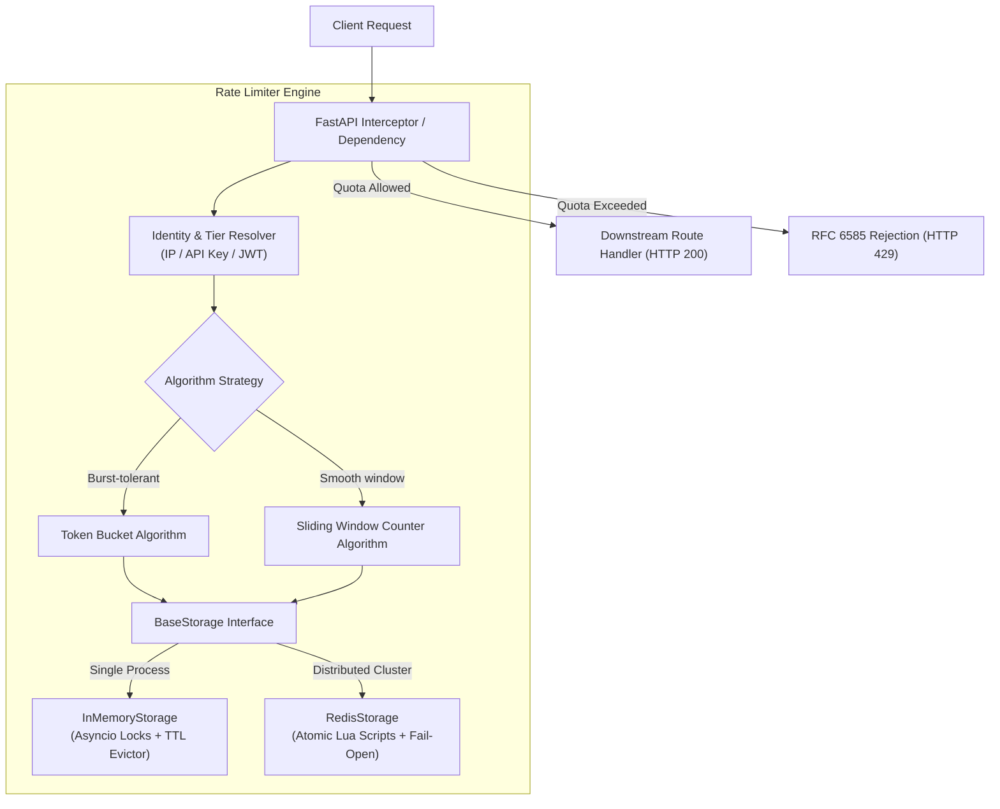

# Production-Grade Rate Limiter for FastAPI

A modular, extensible, and high-performance Rate Limiter built with **Python 3.11+**, **FastAPI**, and **Redis**. Designed to demonstrate core backend engineering competencies: clean software design patterns, concurrency safety, distributed systems fundamentals, robust testing, and production-readiness.

---

## Architecture Overview



---

## Key Features

- **Multiple Algorithms (Strategy Pattern)**:
  - **Token Bucket**: Allows burst traffic up to capacity, refills at continuous rate.
  - **Sliding Window Counter**: Eliminates boundary burst spikes without the memory bloat of sliding window log.
- **Dual Storage Engines**:
  - **In-Memory Store**: Thread-safe and async-safe using per-key `asyncio.Lock` and background TTL eviction.
  - **Distributed Redis Store**: Guarantees zero race conditions across multi-instance clusters using atomic **Lua scripts**.
- **RFC 6585 HTTP Standard Compliance**:
  - Returns `429 Too Many Requests` with informative JSON payload.
  - Injects standard headers:
    - `X-RateLimit-Limit`: Maximum requests allowed in the window.
    - `X-RateLimit-Remaining`: Remaining quota.
    - `X-RateLimit-Reset`: Unix timestamp when quota resets.
    - `Retry-After`: Seconds to wait before next attempt.
- **Flexible Identification & Tiering**:
  - Extracts client IP (with `X-Forwarded-For` reverse-proxy support).
  - API-key tiering (`Free`: 30 req/min, `Pro`: 120 req/min, `Enterprise`: 1000 req/min).
- **Fault-Tolerant (Fail-Open)**:
  - If Redis crashes or experiences network timeouts, the system fails open (logs an alert and permits traffic) to preserve upstream service availability.
- **Tested & Benchmarked**:
  - 100% test pass rate across unit, concurrency, and integration tests.
  - High concurrency stress test proving 0 race conditions.
  - Latency overhead benchmark demonstrating **~2.8 ms P50 latency**.

---

## Algorithm Comparison

| Algorithm | Burst Handling | Memory Complexity | Race Condition Risk | Best Used For |
| :--- | :--- | :--- | :--- | :--- |
| **Token Bucket** | **Excellent** | $O(1)$ per key | High without atomic scripts | General APIs, bursty traffic |
| **Sliding Window** | **Good** | $O(K)$ requests | High without atomic scripts | Strict uniform window enforcement |
| **Fixed Window** | Poor (2x burst at boundary) | $O(1)$ per key | Moderate | Basic quotas, non-critical APIs |
| **Leaky Bucket** | None (forces smooth queue) | $O(\text{queue\_size})$ | Moderate | Egress traffic shaping |

---

## Why Lua Scripts for Redis? (The Race Condition Problem)

In a naive distributed rate limiter, checking remaining quota and decrementing it requires multiple network round-trips:
```
Server 1: GET quota  (returns 1)
Server 2: GET quota  (returns 1)  <-- Race Condition!
Server 1: DECR quota (sets 0)
Server 2: DECR quota (sets -1)    <-- Over-consumption!
```

This project executes the entire logic inside **atomic Redis Lua scripts** (`rate_limiter/storage/lua_scripts.py`). Because Redis executes Lua scripts as a single transactional unit on a single thread:
1. No other Redis command can run in between read and write.
2. Network round-trips are reduced to a single call.
3. Over-consumption under high concurrency is mathematically eliminated.

---

## Quickstart & Installation

### 1. Local Setup (Without Docker)

Clone the repository and create a virtual environment:
```bash
python -m venv .venv

# On Windows:
.\.venv\Scripts\activate
# On Linux/macOS:
source .venv/bin/activate

pip install -r requirements.txt
```

Run the application:
```bash
uvicorn app.main:app --reload --port 8000
```
Visit `http://localhost:8000/docs` to explore the interactive OpenAPI documentation.

### 2. Docker Compose (Distributed Redis Mode)

To run the API connected to a distributed Redis container:
```bash
docker compose up --build
```

---

## Interactive Endpoints Demo

| Endpoint | Protection Method | Quota / Rule |
| :--- | :--- | :--- |
| `GET /api/public` | Token Bucket (IP-based) | 5 requests per 30 seconds |
| `GET /api/sliding` | Sliding Window (IP-based) | 5 requests per 10 seconds |
| `GET /api/tiered` | Tiered (API Key header) | Free (30/min), Pro (120/min), Enterprise (1000/min) |
| `POST /api/auth/login` | Token Bucket (Brute force protection) | 3 attempts per 60 seconds |
| `GET /api/health` | Health Check | **Exempt** (bypasses rate limit) |

### Sample cURL Commands

**1. Normal Request (HTTP 200)**
```bash
curl -i http://localhost:8000/api/public
```
Response Headers:
```http
HTTP/1.1 200 OK
content-type: application/json
X-RateLimit-Limit: 5
X-RateLimit-Remaining: 4
X-RateLimit-Reset: 1789331500
```

**2. Rate Limited Request (HTTP 429)**
When quota is exhausted:
```bash
curl -i http://localhost:8000/api/public
```
Response:
```http
HTTP/1.1 429 Too Many Requests
content-type: application/json
Retry-After: 6
X-RateLimit-Limit: 5
X-RateLimit-Remaining: 0
X-RateLimit-Reset: 1789331500

{
  "detail": {
    "error": "Too Many Requests",
    "retry_after_seconds": 6,
    "reset_epoch": 1789331500,
    "limit": 5
  }
}
```

**3. Authenticated Tier Request**
```bash
# Pro tier:
curl -i -H "X-API-Key: key_pro_user" http://localhost:8000/api/tiered
# Response header: X-RateLimit-Limit: 120

# Free tier:
curl -i -H "X-API-Key: key_free_user" http://localhost:8000/api/tiered
# Response header: X-RateLimit-Limit: 30
```

---

## Running Tests & Concurrency Verification

Run the entire test suite:
```bash
pytest -v
```

### High-Concurrency Stress Test
`tests/test_concurrency.py` fires 50 concurrent requests simultaneously at a limiter with `capacity=10`:
```bash
pytest -v tests/test_concurrency.py
```
**Verification Result**:
```
tests/test_concurrency.py::test_high_concurrency_token_bucket[memory] PASSED
tests/test_concurrency.py::test_high_concurrency_token_bucket[redis] PASSED
tests/test_concurrency.py::test_high_concurrency_sliding_window[memory] PASSED
tests/test_concurrency.py::test_high_concurrency_sliding_window[redis] PASSED
```
*Exact verification: exactly 10 requests pass, exactly 40 are rejected.*

---

## Benchmarking & Latency Overhead

Measure latency overhead under 1,000 concurrent requests:
```bash
python benchmarks/benchmark.py
```

**Sample Benchmark Output**:
```
================================================================
  FastAPI Rate Limiter Concurrency & Latency Benchmark
  Total Requests: 1000 | Concurrency: 50
================================================================

--- RESULTS ---
  Total Time Taken : 2.991 s
  Throughput (RPS) : 334.31 req/s
  200 OK           : 5 requests
  429 Throttled    : 995 requests
  Other / Errors   : 0 requests

--- LATENCY OVERHEAD ---
  Average Latency  : 2.94 ms
  P50 (Median)     : 2.78 ms
  P95              : 6.05 ms
  P99              : 7.62 ms
  Min / Max        : 0.60 ms / 8.41 ms
================================================================
```

---

## Project Structure

```
rate_limiter/
├── rate_limiter/              # Core rate limiting package
│   ├── algorithms/           # Strategy pattern algorithms
│   │   ├── base.py           # BaseAlgorithm abstract class
│   │   ├── token_bucket.py   # Token Bucket algorithm
│   │   └── sliding_window.py # Sliding Window Counter algorithm
│   ├── storage/              # Persistence layer
│   │   ├── base.py           # BaseStorage interface
│   │   ├── memory.py         # Thread-safe in-memory store with TTL sweep
│   │   ├── redis.py          # Distributed Redis store with fail-open
│   │   └── lua_scripts.py    # Atomic Lua scripts
│   ├── middleware/           # FastAPI integration
│   │   ├── dependency.py     # Per-route Depends(RateLimiter)
│   │   └── middleware.py     # App-wide ASGI Middleware
│   ├── rules/                # Key resolution and tier policies
│   │   └── resolver.py       # IP & API key extraction
│   ├── models.py             # Domain models (RateLimitRule, RateLimitResult)
│   └── exceptions.py         # RFC 6585 HTTP 429 exception
├── app/                      # Demo showcase application
│   └── main.py               # Interactive FastAPI app with sample endpoints
├── tests/                    # Comprehensive test suite
│   ├── conftest.py           # Pytest fixtures (memory & fakeredis)
│   ├── test_token_bucket.py  # Token Bucket unit tests
│   ├── test_sliding_window.py# Sliding Window unit tests
│   ├── test_concurrency.py   # 50+ concurrent requests stress test
│   └── test_integration.py   # HTTP headers & fail-open integration tests
├── benchmarks/
│   └── benchmark.py          # Latency & throughput benchmarking script
├── docker-compose.yml        # Docker composition (API + Redis)
├── Dockerfile                # Container definition
├── pyproject.toml            # Project metadata & build settings
├── requirements.txt          # Python dependencies
└── README.md                 # Complete documentation & interview guide
```
